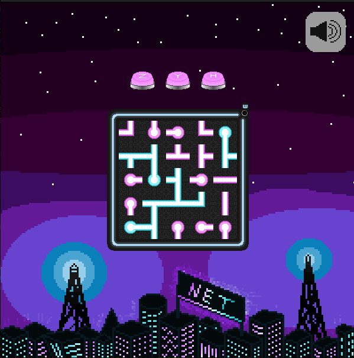

```
                               ,----, 
         ,--.                ,/   .`| 
       ,--.'|    ,---,.    ,`   .'  : 
   ,--,:  : |  ,'  .' |  ;    ;     / 
,`--.'`|  ' :,---.'   |.'___,/    ,'  
|   :  :  | ||   |   .'|    :     |   
:   |   \ | ::   :  |-,;    |.';  ;   
|   : '  '; |:   |  ;/|`----'  |  |   
'   ' ;.    ;|   :   .'    '   :  ;   
|   | | \   ||   |  |-,    |   |  '   
'   : |  ; .''   :  ;/|    '   :  |   
|   | '`--'  |   |    \    ;   |.'    
'   : |      |   :   .'    '---'      
;   |.'      |   | ,'                 
'---'        `----'                   
```                 
  

## Overview 
Welcome to Net, a puzzle game!

This game uses a 5x5 grid where each tile contains a piece representing a pipe or a cable. These pieces can be rotated a quarter turn either to the right or to the left. They come in different shapes: ends, straight segments, elbows, T-junctions, or crosses, oriented in one of the four cardinal directions (North, East, South, West). Each piece is composed of arms extending from the center to its edges, called half-edges.

Good luck!

*Again, the goal isn't to make an amazing game but rather to learn how to code in C, master Git, explore web technologies, and use CMake properly. All development files are fully accessible so you can peek behind the scenes.*

<hr style="border: 5px solid gray;" color="gray"> 
<br>
<br>

# Text Version

## How to Play

Several ways to play are available. To compile the game executables, run the following commands:
```
mkdir build
cd build
cmake ..
make
```
Two executables will be created: :

- To play a pre-made game:

```./game_text [game_to_load]```

- To generate a random game:

```./game_random <nb_rows> <nb_cols> <wrapping> <nb_empty> <nb_extra> <shuffle> [<filename>]```

## Commands

Here are the available commands:
- ```c I J``` Rotates the tile at row I, column J clockwise
- ```a I J``` Rotates the tile at row I, column J counter-clockwise
- ```r``` Resets the game board
- ```z``` Undo last move
- ```y``` Redo last move
- ```q``` Quit (in shame)
- ```h``` Display help 

<br>
<br>
<hr style="border: 5px solid gray;" color="gray">
<br>
<br>

# Graphical Version

A graphical interface is available to enjoy the game visually.

This version includes background music and sound effects. If the required libraries are missing, the game will still run silently. To enable audio support, you’ll need to install the SDL_mixer library using the following command on Linux:

```sudo apt install libsdl2-mixer-dev```

You can mute/unmute the sound anytime by clicking the audio button in-game.

- To play the graphical version of NET: 
```
mkdir build
cd build
cmake ..
make
./game_sdl
```

## Gameplay 

Your goal is to connect all the pieces together.
- When two pieces are connected, their color changes from pink to blue.
- If the green "w" indicator at the top right of the board is on, the wrapping mode is active.
- When all pieces are connected (and blue), the "You win" message is shown.
- Press R to generate a new random game at any time.


## Controls

Voici les différentes commandes pour jouer :

- ```LEFT click``` Rotate the selected tile counter-clockwise
- ```RIGHT click``` Rotate the selected tile clockwise
- ```Z``` or **Z button** Undo
- ```Y``` or **Y button** Redo
- ```H``` or **H button** Show help
- ```R```  Reset the board with a new random game
- ```S``` Save the current game
- ```L``` Load a saved game
- ```K``` Show the solution
- ```M``` Shuffle the board
- ```ESC``` Quit the game

The ```K``` key attempts to solve the game automatically. Some puzzles may be too complex. If no solution is found within 10 seconds, the solving process will stop, and a message will appear. The message disappears after your next move.

All of these functions (except moving tiles with the mouse) are also available through keyboard shortcuts, as in the text version.

# Web Version

We’ve deployed the graphical version on the servers of the University of Bordeaux. It is available at:

👉 https://eliott-peaudeau.emi.u-bordeaux.fr/iamsteve

The features are nearly identical to the desktop graphical version.

## Les auteurs(A17) :

- Siméon Descorps
- Aala Ajmaime
- Eliott Peaudeau